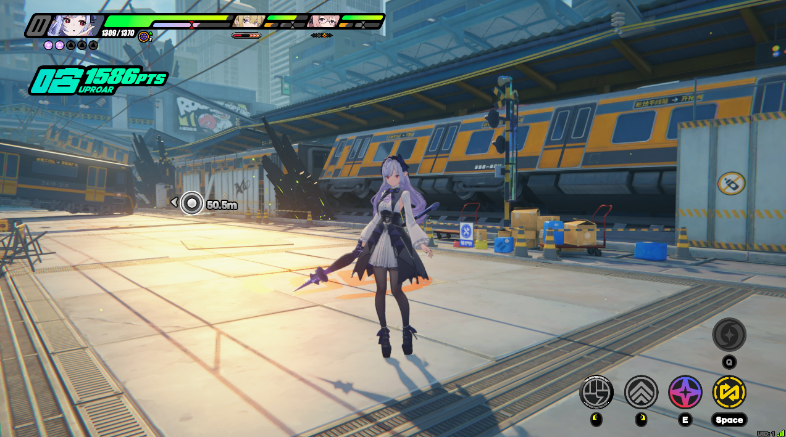
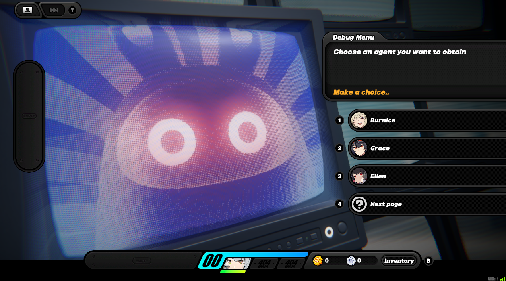
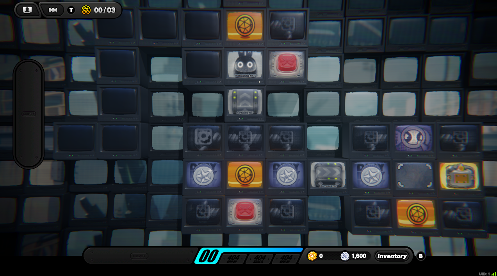

# Yixuan-rs
##### Experimental server emulator for the game Zenless Zone Zero


## Features
- Microservices Architecture
- Quest System
- VR Training, Notorious Hunt
- Story Commissions in HDD
- "TV Mode" aka Monitor Array
- Gacha (with configurable banner schedule)
- NPC Interactions
- Miscellaneous items (Skins, W-Engines, Drive Discs, Proxy Accessories, Wallpapers)
#### NOTE: yixuan-rs is currently under active development

## Getting started
### Requirements
- [Rust 1.86+](https://www.rust-lang.org/tools/install)
- SQLite (used by default, no separate installation needed)
- [SDK server](https://git.xeondev.com/reversedrooms/hoyo-sdk)
##### NOTE: this server doesn't include the sdk server as it's not specific per game. You can use `hoyo-sdk` with this server.

#### For additional help, you can join the Original Dev's Server: [discord server](https://discord.xeondev.com)

### Setup
#### a) building from sources
```sh
git clone https://git.xeondev.com/yixuan-rs/yixuan-rs.git
cd yixuan-rs
cargo run --bin yixuan-dispatch-server
cargo run --bin yixuan-gate-server
cargo run --bin yixuan-dbgate-server
cargo run --bin yixuan-game-server
cargo run --bin yixuan-muip-server
```
#### b) using pre-built binaries
Navigate to the [Releases](https://git.xeondev.com/yixuan-rs/yixuan-rs/releases) page and download the latest release for your platform.
Start each service in order from option `a)`.

### Configuration
The configuration of each server is located under the `config` directory (created upon first startup)
- To change network settings for internal server communication, edit the: `config/00-service/environment.toml`
- To change network settings for outer communication (e.g. with the game client), edit the dispatch-server and gate-server configuration, located in `config/10-dispatch-server/config.toml` and `config/20-gate-server/config.toml` respectively.
- The dbgate-server now uses SQLite by default. Its configuration, primarily the path to the database file (e.g., `data/yixuan.db`), is in: `config/30-dbgate-server/config.toml`
- To change gameplay-related settings, edit one of game-server configuration files, for example: gacha banner schedule is located in: `config/40-game-server/gacha_schedule.toml`

### Logging in
Currently supported client version is `OSPRODWin2.0.0`, you can get it from 3rd party sources (e.g. game launcher). Next, you have to apply the necessary [client patch](https://git.xeondev.com/yixuan-rs/yixuan-patch). It allows you to connect to the local server and replaces encryption keys with custom ones.

### Obtaining characters without gacha
While playing on the server, you may want to obtain the characters that are not available in current gacha schedule. In order to do so, you can use in-game debug menu: find the 'Yixuan' NPC on the second floor of WorkShop location, and interact with it. It'll send you to a debug TV mode scene, where you can select the characters to obtain.


### Gameplay customization
The MainCity quests and TV mode levels are highly customizable by their nature. You may look around the `assets/LevelProcess` directory.


## Acknowledgements
- Special thanks to @TomerGamerTV for assistance with migrating the database to SQLite.

### Support
Your support for this project is greatly appreciated! If you'd like to contribute, feel free to send a tip [via Boosty](https://boosty.to/xeondev/donate)!
